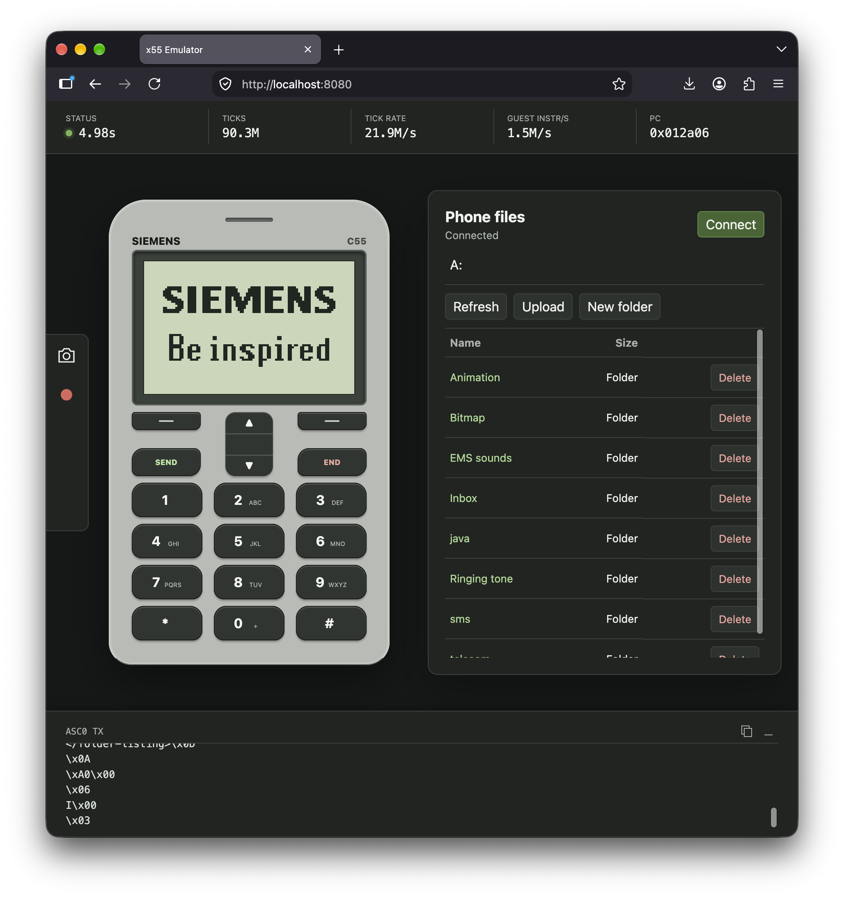

# PMB7850 / E-GOLD+ V3 emulator

I wanted to learn more about firmware emulation and QEMU, and to see how efficient and useful modern LLMs could be for this task (spoiler: very much so). The project took a few months of weekend work and a paid Codex subscription. I chose the [Siemens C55](https://lpcwiki.miraheze.org/wiki/Siemens_C55), my first mobile phone, which I got as a kid in 2003. It opened the internet to me through WAP over GPRS, and I loved tinkering with it—installing community patches and hacking around with its software. This is a toy project built for learning and nostalgia, with no practical purpose beyond that: we are emulating hardware more than 20 years old. There is still plenty of code to clean up and refactor. I deliberately left the research and investigation documents out of this repository because they need substantial cleanup and refinement too; I may publish them later.

I relied on Codex to write and revise the emulator code. I chose the questions, supplied evidence, ran experiments, and challenged the results. This repository shows what that work produced, including the parts of the emulator that remain incomplete.

The project runs Siemens x55 firmware—the phone's original software—by modeling its PMB7850 / E-GOLD+ V3 main chip and the C166S processor that executes its instructions. The shared runner, `emu/bin/emu`, chooses one engine per run. CEMU, the default and the reference for checking behavior, executes the instructions inside the runner. QEMU is an optional second implementation that the runner starts and manages as a separate program. A Python Web UI server can connect over an optional local UI socket, a link between programs, and serve a browser view. The runner also exposes the display, keys, serial connection, traces, debugging, saved states, and some audio behavior; support varies by feature and phone.

CEMU can be slow on long runs, so QEMU is preferred when speed matters. The CEMU core has no third-party library dependencies. Both CEMU and QEMU builds have been verified on the latest Ubuntu and macOS releases.

```text
firmware -> emu/bin/emu (shared runner; one engine per run)
              |-- CEMU (default, inside the runner)
              `-- QEMU (optional, separate program managed by the runner)

            optional local UI connection <-> Web UI server <-> browser
```



[Here is a Youtube video that shows it in action.](https://youtu.be/UsrlVmzkAiQ)

## Supported devices

All twelve configurations model the processor, screen, keys, timers, and battery input. An optional simulated SIM card is off by default. Serial file access means a tested firmware image has listed folders over a wired connection; **No** means “not yet demonstrated.” C55 SW24 needs the explicit patch noted in the table. Sound lists playback demonstrated on a tested image, not every sound the phone can play. The phone firmware converts MIDI files into its compact SI3 sound commands; the emulator's synthesized timbre is approximate. The NOR flash entries name emulator compatibility models; some fitted dies remain unverified.

| Example LCD capture | Phone | Screen and modeled controller | NOR flash model | Serial file access | Sound demonstrated | Notable limits |
|---|---|---|---|---|---|---|
|  | A52 | Monochrome, 101×64<br>PCF8813-compatible | M58LW064D-compatible | No | Ringer; SI3 | — |
|  | A55 | Monochrome, 101×64<br>PCF8813-compatible | M58LW064D-compatible | No | SI3 | Screen wiring inferred from C55 |
|  | A60 | Color, 101×80<br>HM17CM4096-compatible | AM29LV640MH | Yes | Ringer; MIDI | — |
|  | A62 | Color, 101×80<br>HM17CM4096-compatible | AM29LV640MH | Yes | MIDI | Most keys not yet checked |
|  | A65 | Color, 101×80<br>HM17CM4096-compatible | AM29LV128MH or W30 128-Mbit top | Yes | MIDI; WAV | Screen variant not physically verified |
|  | C55 | Monochrome, 101×64<br>PCF8813-compatible | M58LW064D-compatible | Yes | Ringer; SI3/MIDI; WAV | SW24 requires an explicit firmware patch for serial file access |
|  | C60 | Color, 101×80<br>HM17CM4096-compatible | AM29LV128MH or W30 128-Mbit top | Yes | Ringer; MIDI | — |
|  | CF62 | Color, 130×130 main screen<br>S6B33Bx-compatible | AM29LV128MH or W30 128-Mbit top | Yes | MIDI | Main screen only; lid fixed open |
|  | M55 | Color, 101×80<br>HM17CM4096-compatible | AM29LV128MH | Yes | MIDI; WAV | — |
|  | MC60 | Color, 101×80<br>HM17CM4096-compatible | AM29LV128MH | Yes | MIDI | Camera hardware reply unverified |
|  | S55 | Color, 101×80<br>HM17CM256 | W30 64-Mbit top; M58LW064D-compatible secondary | Yes | Not yet qualified | Bluetooth, infrared, and audio incomplete |
|  | SL55 | Color, 101×80<br>PCF8833-compatible four-wire | W30 64-Mbit top; M58LW064D-compatible secondary | Yes | Not yet qualified | Slider and side keys unresolved |

## Try a bundled image

From a clone of this repository, build the runner:

```sh
git submodule update --init emu/vendor/carquet
python3.14 -m venv .venv
.venv/bin/python -m pip install -r emu/requirements.txt
make -C emu deps
make -C emu
```

Start the Web UI server in one terminal:

```sh
PYTHONPATH=emu .venv/bin/python -m tools.web_ui --connect /tmp/pmb7850-c55.sock
```

In another terminal, run the bundled C55 SW24 with the same UI socket path:

```sh
emu/bin/emu run firmware/C55/c55sw240101-556677-20dd57d8ec1f.bin \
  --device c55 --fsn 1234ABCD --ui-socket /tmp/pmb7850-c55.sock
```

Open `http://127.0.0.1:8765/` to see the phone and use its keys. This runs CEMU by default and has no instruction limit. Press Ctrl+C in each terminal to stop the emulator and Web UI server. The phone starts without a SIM card; add `--sim` to the runner command if you want to attach the simulated test card.

If QEMU is built, add `--engine qemu` to the runner command to select it.

See the [build and run guide](emu/README.md#build-this-checkout) and [firmware manifest](firmware/manifest.json) for dependencies, other images, hashes, and exact input settings. The terminal check covers only early startup; usable screens and controls vary by image, and QEMU results also vary.

## Sources and acknowledgments

Community Siemens firmware dumps made the original experiment possible. [Ghidra](https://ghidra-sre.org/), the [C166 Ghidra module](https://github.com/keyhana/c166-ghidra-module), and [Ghidra MCP](https://github.com/bethington/ghidra-mcp) supported targeted reverse engineering; [siemens-fw-tool](https://github.com/siemens-mobile-hacks/siemens-fw-tool) helped inspect Siemens firmware formats. The work also required reverse engineering several Siemens service and flashing utilities. The independent engine builds on [QEMU](https://www.qemu.org/). CPU, board, display, and flash manuals supplied hardware rules; observed firmware behavior remains the check on how those rules apply here.

## How I got here

I began with C55 fullflash dumps shared by the Siemens phone community: copies of the phone's stored software and data, but no running handset to show what those bytes did. My first Python emulator could carry out one processor instruction, a single operation such as reading a value or adding two numbers. It was a tiny result, yet it gave me a repeatable question: what does the next instruction read or change? Each answer could become another rule in the model. I treated the dump as evidence, rather than changing its software until a desired screen appeared.

Ghidra, a tool that turns raw bytes into readable processor instructions, helped me examine small parts of the firmware. The C166S manuals explained what each instruction should do, including rules I could easily have guessed wrong. When the phone took an unexpected path, I compared its instruction bytes, the manual, and the values the emulator had used before deciding that some hardware behavior was missing. This was slower than inventing a convenient answer, but it kept each fix tied to something I could check.

Early startup made me rethink the phone's memory map. Flash keeps software when power is off; RAM is temporary working space. Some addresses I had treated as flash were actually views into RAM, which the firmware spent a long time clearing. Later, a write to the start of flash looked like a mistake until the flash datasheet showed it was a command asking the chip to identify itself. Representing those different behaviors let the original firmware move forward on its own. A changed screen or a longer run mattered only if the model also explained the reads and writes that led there.

That long RAM clear produced another useful question: was the phone stuck, or was it doing work? The same instruction address appeared again and again, but the destination of each write kept moving. I added a monitor that watched both the repeated code and the data it changed. It helped distinguish a productive loop from a wait for a timer or another piece of hardware. When a hardware control value seemed suspicious, I checked how the firmware used it before turning it into a new device rule; a busy-looking access could still belong to an error loop.

The phone also expected persistent settings and identity records, not just executable software. Missing or inconsistent records could stop startup even when the processor model was correct. I followed the bytes from the dump into working memory and checked what the firmware tested before supplying any generated identity or calibrated hardware reply—a value chosen to match observed software behavior rather than a physical measurement. A successful run with such input shows what that firmware accepts under those conditions; it does not reveal what every physical C55 contains.

Python made experiments easy to change, but millions of simulated instructions took minutes. I moved the processor and phone hardware model to C, then compared saved machine states against the Python version, including a run from the beginning. On that early workload, CEMU ran about **200–900×** faster than Python. The range describes that comparison, not every phone or computer. More importantly, I could rerun an experiment in seconds and test another explanation while the question was still fresh.

The monitor became a way to choose what to investigate next. Its summary showed where the phone spent time, which parts of memory changed, and what caused a run to stop. For a closer look, a trace—a time-ordered record of reads, writes, and device events—showed the steps leading to a result. The summary could point me to a suspicious spot; the trace and manuals helped me decide whether anything in the emulator actually needed to change.

The display made the work feel like a phone for the first time. The C55 sent commands and picture data to an LCD controller, the chip that decides how bytes become visible pixels. Receiving a complete picture was not enough: the controller also had to be powered on and use the right screen addresses. Comparing the firmware's commands with a controller datasheet corrected my earlier choice of display model. Then the unmodified firmware produced the C55's screen asking for a SIM card. I kept the incoming commands and the rendered image observable so a convincing picture could be checked against what the phone had actually sent.

That controller is also my favorite example of how I used Codex. I first prepared a repeatable run, recorded the firmware's display commands, and found the relevant rules in a datasheet. With a concrete pass condition, Codex generated the component in one pass. The result still had to pass against real firmware traffic and tests. The useful unit of progress was a question I could reproduce and answer, rather than the amount of code produced.

Once the screen and keys worked, I added a Web UI so I could use the modeled phone from a browser. It shows the firmware's display and lets me press keys without stepping through a terminal. The browser became another way to observe the phone, while the running firmware remained the source of what appeared on screen.

As the models grew, their traces became too large to inspect conveniently as text. CEMU now writes them in compressed Parquet files, a table format that lets me search for a particular event, address, or time interval without scanning the whole log. This made it easier to compare a new run with an earlier one and find the first place their behavior differed.

After C55, I added configurations for eleven more Siemens phones instead of building eleven separate emulators. They share the processor and much of the main chip, but their screens, flash chips, memory, and board connections differ. Each firmware image gave me a new way to test the shared model and exposed assumptions that happened to work on C55. A phone's presence in the list does not mean every image runs equally far; I checked each against its own visible startup milestone and kept uncertain hardware identities labeled as such.

A wired serial connection brought a different milestone: the phone's own software could answer a host computer. Once I modeled the timing and signaling it expected, nine tested handset images reached their file service and listed directories without changing their firmware. C55 SW24 answers early commands but needs an explicit one-byte firmware patch for that file service; A52 and A55 remain unresolved. Those differences matter because the host only transports bytes. It does not invent the phone's replies, and a file listing exercises the processor, serial connection, and stored files together.

I later built a second emulator using QEMU. CEMU reads and executes the phone's instructions one by one; QEMU can translate groups of them into reusable computer code. That offered a possible speed gain, but the two independent implementations were also a powerful check on each other. They should agree on the order in which the phone reads memory, handles interrupts (signals that make the processor respond to an event), and talks to flash, serial, and display hardware, even when their final screens happen to look the same.

The first QEMU runs showed why a faster instruction engine is not automatically a faster phone emulator. The way I connected flash to QEMU initially let it reuse only one translated instruction at a time. I changed that memory path while preserving flash commands and checked the resulting phone state and device activity before measuring speed again. QEMU can be faster on a particular run, but results still vary by image and some comparisons fail their checks. Speed is useful only when the phone is still doing the right work.

Sound gave me another observable path through the phone. I traced the ringtone's timer edges and the audio commands produced when firmware played SI3 files or converted MIDI. The C55 firmware contains instrument parameters, and the service manual describes a DSP sound solution, but I did not recover the DSP program or enough of its synthesis rules to recreate the original timbres. For SI3/MIDI playback, I used a simple multi-voice synthesizer with triangle-wave oscillators that follows the observed notes and timing. It makes the music audible, but the tone is an emulator approximation.

What began as one Python instruction is now a runnable set of phone models and tools for questioning them. Some C55 behavior has strict comparisons between engines; other images have only limited startup checks or known gaps. I still treat a wrong screen, a stalled boot, or a mismatched trace as a question to investigate. The best result of the experiment is that I can repeat a run and tell whether a proposed answer changed what the phone actually did.
